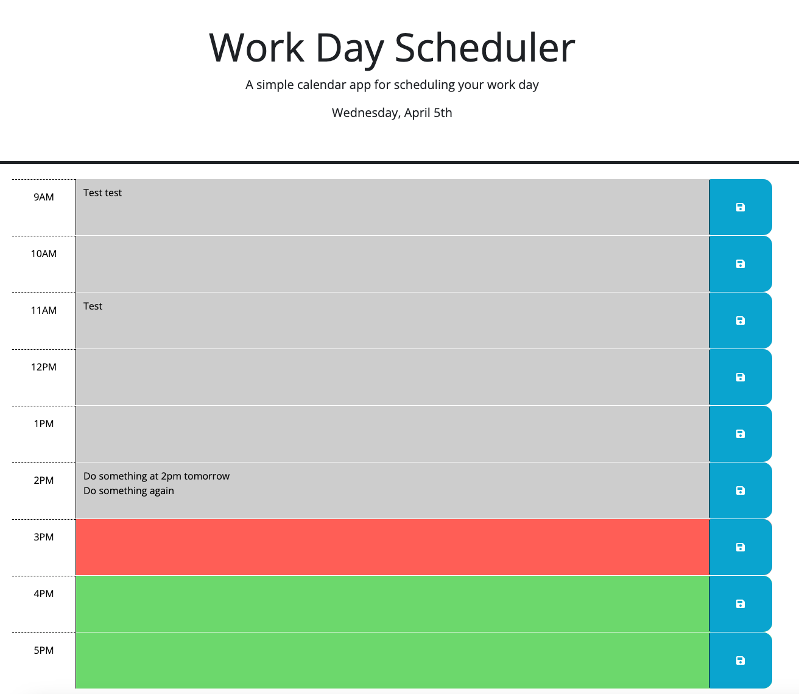

# Workday Planner

Having gotten a little Javascript experience under my belt, I'd like to start playing around with some third-party APIs, specifically [JQuery](https://jquery.com/) and [Bootstrap](https://getbootstrap.com/). I'm not interested in building anything too complicated at this point, but to get my feet wet, I'll build a simple day planner.

| **Scenario**                                                                                                                                                                                                                                                                                                                                                                     |
| :------------------------------------------------------------------------------------------------------------------------------------------------------------------------------------------------------------------------------------------------------------------------------------------------------------------------------------------------------------------------------- |
| _I want to be able to schedule my day by the hour. When I open the app, I want to see what day it is. Then I want to see the hours of the day listed out with space to add notes/comments about what I'll be doing in that hour. Because my days are fairly regular, I want to be able to save what I write in those fields and have them show up if I refresh the application._ |

My goal here is not to make a particularly beautiful tool, but to focus on exploring JQuery's syntax and methods. As such, I'm going to try to construct most of the HTML elements using JQuery. I'll implement Bootstrap, but only in the sense that I'd like to begin familiarizing myself with the documentation.

For the date/time functionality, I'll be taking a look at [Day.js](https://day.js.org/)

---

## Finished Product (For Now)

[The deployed application is here.](https://austinzumbro.github.io/workday-planner)

And here is a quick screenshot of what it looks like:


---

## My Approach

### Using JQuery to Construct the Scheduler

Having just finished a project where I constructed a page using basic Javascript, doing the same thing with JQuery was much more pleasant.

Specifically, the JQuery method for declaring HTML elements and their attributes at the same time was an absolute treat.

For context: because the scheduler is just a set of repeating rows, I could construct the entire thing with a `for` loop and just assign new IDs and properties based on where we were in the loop.

```javascript
for (let i = workdayStart; i < workdayEnd; i++) {
    // Construct the parent "hour" row
    let divRow = $("<div>", {
    id: "hour-" + i,
    class: "row time-block",
    });

    // Apply classes based on current time
    if (currentHour > i) {
    divRow.addClass("past");
    } else if (currentHour == i) {
    divRow.addClass("present");
    } else {
    divRow.addClass("future");
    }

    // etc., etc.
```

I'm highlighting this section because it features two of my new favorite things about JQuery.

1. The `$("<element>", {object})` syntax is very easy to write and much less confusing to parse and edit when I inevitably want to make changes.
2. It's really handy to simply use the `.addClass` method to add a class(!), as opposed to overwriting the whole thing with `.setAttribute('class', 'new-class old-clas-that-was-working-but-now-has-a-typo-in-it')`

In those if/else statements, you can also see I applied some classes based on the current hour whenever the user loads the application. Which is a great segue into talking about Day.js.

---

### Date/Time with Day.js

I played around a little with Day.js, but I didn't get too creative with anything.

The app displays the current day at the top of the page, a process that allowed me to play around with the `.format()` method.

```javascript
let currentDay = dayjs();
let currentDayInt = currentDay.date();

// Format the current day
let dayText = currentDay.format("dddd, MMMM D");
if (currentDayInt == 1 || currentDayInt == 21 || currentDayInt == 31) {
  dayText += "st";
} else if (currentDayInt == 2 || currentDayInt == 22) {
  dayText += "nd";
} else if (currentDayInt == 3 || currentDayInt == 23) {
  dayText += "rd";
} else {
  dayText += "th";
}
```

> I messed this up the first time!
>
> I originally called `currentDay.day()`, which pulls the day of the week (0-6) not the day of the month (1-31), and it took me forver to figure out why my "st" / "nd" / "rd" / "th" appendages weren't working right.

---

### Saving to localStorage

I've done this before, so it wasn't too complicated, but it was another opportunity to look at a few of JQuery's tree traversal methods.

```javascript
$("button").on("click", function () {
  let parentRow = $(this).parent();
  let rowID = parentRow[0].id;
  let textarea = parentRow.children("textarea");
  let textAreaContent = textarea[0].value;

  localStorage.setItem(rowID, textAreaContent);
});
```

1. User clicks a save button.
2. Look at the parent element of that button, in this case the row.
3. Save the ID of that row.
4. Starting from that parent element, find the child that's a `<textarea>` and get its contents.
5. Save those contents to localStorage using the row ID as a key.

Simple!

---

## Looking Forward

This was a quick dip, but there is clearly a whole world of things to explore. Bootstrap alone is... extensive... and I hardly touched it here.

If I were going to spend more time on this, I'd probably look at expanding the application out beyond a single day to include an actual month-to-month calendar. But even on the single-day view there are lots of things to improve.

- You could make the hour rows expandable and collapsible so you could declutter the screen. Maybe set "past" hours to default collapsed, but allow expansion to see what was there.
- You could store text input not as a single textarea, but as clickable-and-draggable elements that you could reorder or copy.
- Maybe we want popovers that let you assign a color to indicate an activity type or a level of importance?
- And on and on and on.

---

## Credits

- [JQuery](https://jquery.com/)
- [Bootstrap](https://getbootstrap.com/)
- [Day.js](https://day.js.org/)

---

## License

MIT License

Copyright (c) 2023 Austin Zumbro

Permission is hereby granted, free of charge, to any person obtaining a copy
of this software and associated documentation files (the "Software"), to deal
in the Software without restriction, including without limitation the rights
to use, copy, modify, merge, publish, distribute, sublicense, and/or sell
copies of the Software, and to permit persons to whom the Software is
furnished to do so, subject to the following conditions:

The above copyright notice and this permission notice shall be included in all
copies or substantial portions of the Software.

THE SOFTWARE IS PROVIDED "AS IS", WITHOUT WARRANTY OF ANY KIND, EXPRESS OR
IMPLIED, INCLUDING BUT NOT LIMITED TO THE WARRANTIES OF MERCHANTABILITY,
FITNESS FOR A PARTICULAR PURPOSE AND NONINFRINGEMENT. IN NO EVENT SHALL THE
AUTHORS OR COPYRIGHT HOLDERS BE LIABLE FOR ANY CLAIM, DAMAGES OR OTHER
LIABILITY, WHETHER IN AN ACTION OF CONTRACT, TORT OR OTHERWISE, ARISING FROM,
OUT OF OR IN CONNECTION WITH THE SOFTWARE OR THE USE OR OTHER DEALINGS IN THE
SOFTWARE.
